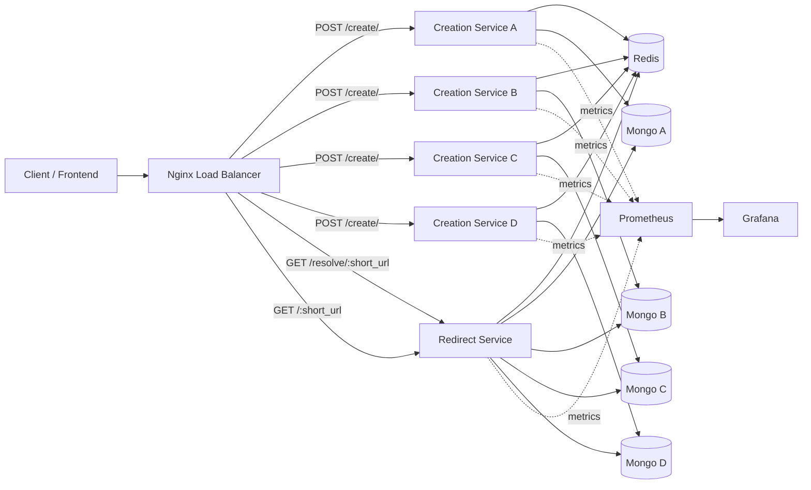
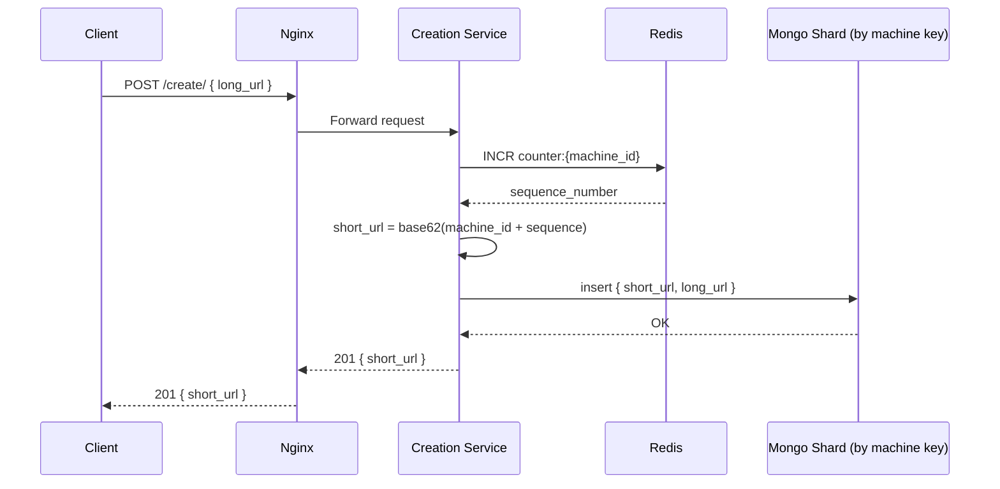
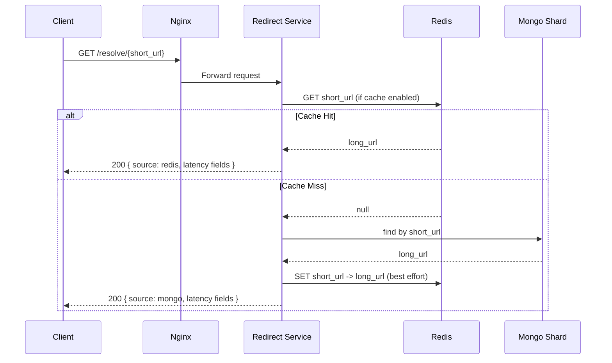
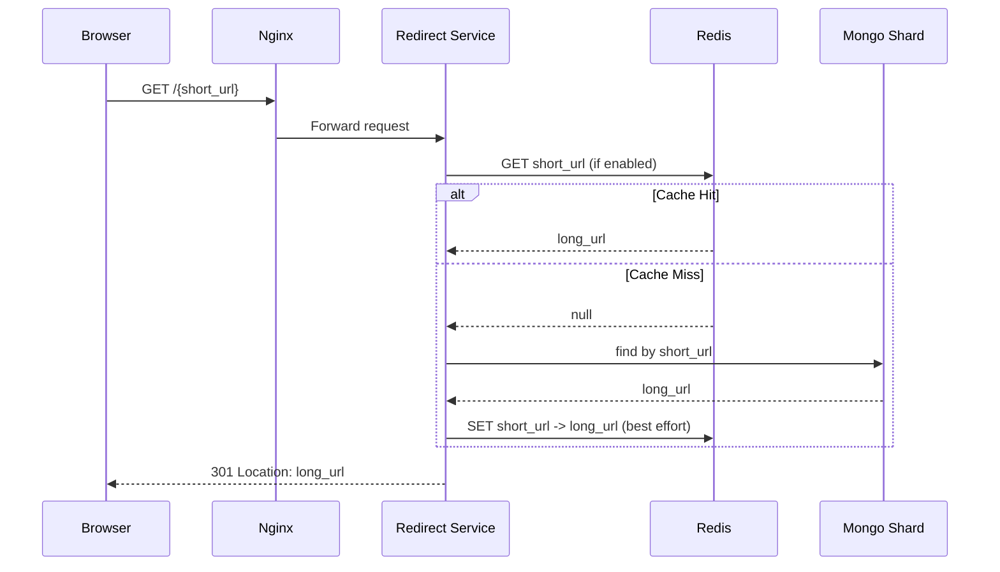

# URL Shortener - System Design Document

## 1. Problem Statement
Build a URL shortener that converts long URLs into compact short codes, serves low-latency redirects at high read volume, and scales horizontally with predictable performance.

Core goal:
- Write path should remain simple and fast.
- Read path should be highly optimized because redirects dominate traffic.
- System should be observable, testable, and easy to evolve.

---

## 2. Scope and Requirements

### Functional Requirements
- Create short URL from a long URL.
- Resolve short URL to original long URL.
- Redirect short URL with HTTP 301.
- Route data to correct storage shard.
- Optionally serve hot reads from cache.

### Non-Functional Requirements
- Low p95 read latency under load.
- High availability during partial component failures.
- Horizontal scalability of API tier.
- Deterministic shard routing.
- Basic observability (metrics + dashboards).

### Out of Scope (Current Version)
- Custom aliases.
- URL expiration and TTL policies.
- Auth, quotas, abuse prevention.
- Analytics pipeline for click tracking.
- Multi-region replication.

---

## 3. High-Level Design (HLD)

### Architecture Summary
The system is decomposed into two services:
- URL Creation Service: generates short codes and persists mappings.
- URL Redirect Service: resolves and redirects, with optional Redis cache acceleration.

Ingress is handled by Nginx:
- /create/ -> creation service cluster (4 replicas)
- / and /resolve/{code} -> redirect service

Data layer:
- Redis for sequence generation and read cache.
- 4 MongoDB instances acting as logical shards (a, b, c, d).

Observability:
- FastAPI instrumentation exports Prometheus metrics.
- Prometheus scrapes service metrics.
- Grafana dashboards visualize latency and throughput.

---

## 4. Component Diagram



---

## 5. Sequence Diagrams

### 5.1 Create Short URL



### 5.2 Resolve Metadata (Debug/Inspection Path)



### 5.3 Redirect Path



---

## 6. Data Model and Sharding

### Mongo Document
Collection: url_shortener.urls

Example document:
- short_url: string
- long_url: string

### Shard Strategy
- First character of short_url is machine_id (a, b, c, d).
- Redirect service extracts short_url[0] to select shard.
- Creation service writes to the shard of its machine_id.

Why this works:
- O(1) shard routing, no external metadata lookup.
- Predictable key ownership.

Risk:
- Hot key skew if one machine_id dominates write traffic.

---

## 7. API Design

### 7.1 Create API
Endpoint:
- POST /create/

Request body:
```json
{
  "long_url": "https://example.com/path"
}
```

Success response (201):
```json
{
  "short_url": "a1B2"
}
```

Errors:
- 400 invalid input
- 503 persistence failures
- 500 unexpected service failures

### 7.2 Resolve API
Endpoint:
- GET /resolve/{short_url}

Success response (200):
```json
{
  "short_url": "a1B2",
  "long_url": "https://example.com/path",
  "source": "redis",
  "redis_lookup_ms": 0.4,
  "db_lookup_ms": null,
  "total_latency_ms": 1.1
}
```

Errors:
- 404 short URL not found
- 503 cache/db lookup failure
- 500 unexpected service failures

### 7.3 Redirect API
Endpoint:
- GET /{short_url}

Success response:
- HTTP 301 with Location header set to normalized long URL

Errors:
- 404 short URL not found
- 503 data access failures
- 500 unexpected service failures

---

## 8. Algorithms and Tradeoffs

### 8.1 ID Generation
Current approach:
- Global-per-machine counter in Redis using INCR.
- Unique ID = sequence number.
- Short code = machine_id prefix + Base62(sequence).

Pros:
- Very fast and simple.
- Monotonic IDs per machine.
- Easy shard inference.

Cons:
- Redis is in write path; Redis outage impacts creation.
- Predictable IDs can leak creation volume patterns.

Alternative choices:
- Snowflake-style 64-bit IDs (time + node + seq): less central dependency.
- Random IDs with collision checks: better unpredictability, higher DB cost.

### 8.2 Cache-Aside on Reads
Current approach:
- Read Redis first.
- Fallback to Mongo.
- On miss, warm Redis.

Pros:
- Strong read latency improvement for hot URLs.
- Keeps write path simple.

Cons:
- First read after write can be slower.
- No TTL/eviction policy tuning documented yet.

### 8.3 Shard-by-Prefix Routing
Pros:
- Constant-time routing.
- No routing table service.

Cons:
- Scaling shard count from 4 to many requires prefix strategy migration.

---

## 9. System Capabilities

### Current Capabilities
- Horizontal scale for creation API via multiple replicas.
- Dedicated redirect service optimized for read-heavy workloads.
- Optional Redis cache toggle via ENABLE_REDIS_CACHE.
- Deterministic data partitioning across four Mongo instances.
- Prometheus and Grafana integration for SRE visibility.
- k6 load-test suite with objective-based verdict output.

### Operational Capabilities
- Full stack can run locally with Docker Compose.
- Separate services allow independent scaling and failure domains.
- CORS configuration supports local frontend development.

---

## 10. Capacity and Performance Notes

Simple planning model:
- Let R be redirect QPS.
- Let H be cache hit ratio.
- Mongo read QPS approx R x (1 - H).
- Redis read QPS approx R.

Implication:
- Even moderate H significantly offloads Mongo.
- Improving H is often the highest ROI optimization for this architecture.

Key latency indicators:
- p95 redirect latency
- cache hit ratio
- 5xx error rate

---

## 11. Reliability and Failure Behavior

### If Redis is slow/unavailable
- Create path fails on sequence generation (current behavior).
- Redirect path can still serve from Mongo if cache lookup errors are handled as fallback (current code raises 503 on explicit cache failure path).

### If one Mongo shard is unavailable
- Requests mapped to that shard fail.
- Other shards continue serving.

### Nginx behavior
- Routes write traffic to creation cluster.
- Routes read and redirect traffic to redirect service.

Recommended future improvements:
- Retry and circuit-breaker strategy for Redis and Mongo.
- Replication and failover for Mongo shards.
- Redis HA configuration.

---

## 12. Security Considerations

Current baseline:
- Input presence validation exists.
- Redirect URL scheme normalization adds https:// when missing.

Gaps to consider:
- URL validation/sanitization hardening.
- Malware/phishing domain checks.
- Rate limiting and abuse controls.
- Auth for management endpoints.
- HTTPS termination and secure headers in production.

---

## 13. Observability

Implemented:
- Prometheus metrics exposure via FastAPI instrumentator.
- Grafana dashboards provisioned in repository.

Recommended SLO set:
- Redirect availability: 99.9 percent
- Redirect p95 latency: less than 300 ms
- Create p95 latency: less than 500 ms
- Error rate: less than 1 percent

Useful dashboards:
- Request rate by endpoint
- p50/p95/p99 latency by endpoint
- Redis hit vs miss trend
- Mongo per-shard query volume and errors

---

## 14. Testing Strategy

### Unit and Integration
- URL encoding/decoding correctness.
- Shard router behavior for all machine IDs.
- Exception-to-HTTP mapping tests.

### Load Testing
See load-tests/k6 for objective-driven scripts:
- stress.js for end-to-end create + resolve + redirect objective validation.
- redirect-stress.js for redirect-focused objective validation.
- architecture-compare.js for baseline vs candidate comparison.

Each script prints a final verdict in this format:
- ACHIEVED: goal X using method Y
- NOT ACHIEVED: goal X using method Y

---

## 15. Deployment Topology (Current Compose)

Services:
- redis
- mongo_a, mongo_b, mongo_c, mongo_d
- url_creation_service_a, b, c, d
- url_redirect_service
- load_balancer (nginx)
- prometheus
- grafana

Edge exposure:
- Port 80 for URL APIs via Nginx.
- Port 9090 for Prometheus.
- Port 3000 for Grafana.

---

## 16. Roadmap

### Near-Term
- Add TTL policy for cached mappings.
- Add stricter URL validator.
- Add idempotency support in create API.
- Add rate limiting at Nginx.

### Mid-Term
- Move to Snowflake-like ID generation.
- Add replication and failover per Mongo shard.
- Add asynchronous click analytics pipeline.

### Long-Term
- Multi-region active-active deployment.
- Geo-aware routing and global edge redirect optimization.

---

## 17. Design Review Checklist

Before production hardening, verify:
- Load tests prove target SLOs with realistic traffic shape.
- Error budgets and alerting thresholds are defined.
- Backup and restore process tested for all shards.
- Capacity plan includes growth assumptions and saturation points.
- Security controls (abuse prevention, domain policy, auth) are enforced.
